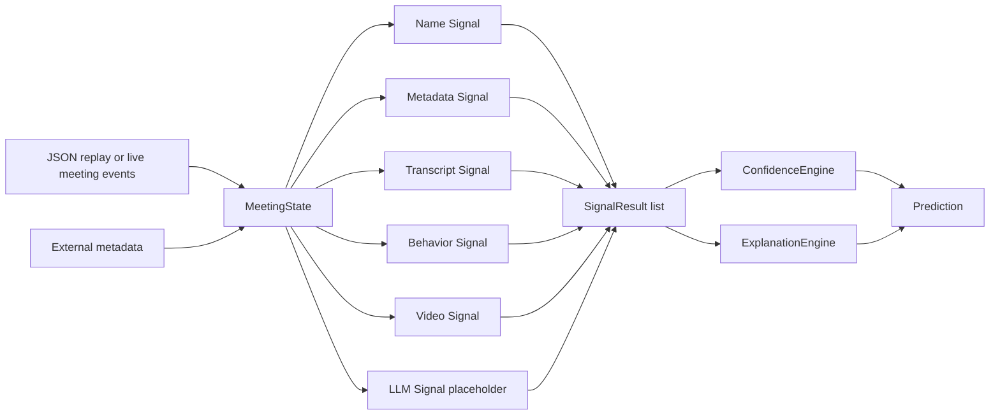

# Architecture

The system treats candidate identification as evidence fusion across weak signals:

- Identity metadata: display name, email, candidate name, interviewer names.
- Behavior: webcam state, speaking share, transcript turns, screen share.
- Transcript reasoning: deterministic placeholders now, LLM-backed role reasoning later.
- Exclusion: known interviewers are penalized so they are not selected accidentally.

The current implementation is intentionally explainable and deterministic. In production, each signal can be upgraded independently with stronger model-backed evidence such as face matching, voice enrollment, semantic transcript embeddings, or calibrated LLM role reasoning.
